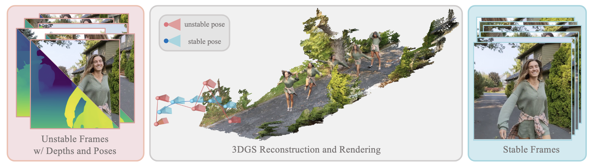

# GaVS: 3D-Grounded Video Stabilization via Temporally-Consistent Local Reconstruction and Rendering (SIGGRAPH 2025)

<p align="center">
  
</p>


> [GaVS: 3D-Grounded Video Stabilization via Temporally-Consistent Local Reconstruction and Rendering](https://drive.google.com/file/d/1EODPfxaPR-fBLhlAVOdTHz7MTe9XBTJk/view?usp=sharing) (SIGGRAPH 2025 Conference Paper)  
> Zinuo You,  Stamatios Georgoulis,  Anpei Chen,  Siyu Tang,  Dengxin Dai

[](https://drive.google.com/file/d/1EODPfxaPR-fBLhlAVOdTHz7MTe9XBTJk/view?usp=drive_link)
[](https://sinoyou.github.io/gavs/)
[](https://huggingface.co/datasets/sinoyou/gavs-data/tree/main/dataset)
[](https://huggingface.co/datasets/sinoyou/gavs-data/tree/main/result_and_comparison)


# Setup

## Clone

```
git clone https://github.com/sinoyou/gavs.git
```

## Create a python environment

GaVS has been trained and tested with the followings software versions: **Python 3.10, CUDA 12.6**

create and activate conda environment 

```sh
conda create -n gavs python=3.10
conda activate gavs
```

or place local victual environment

```sh
conda create -p ./venv python=3.10
conda activate ./venv
```

Finally, install the required packages in the following order, 

```sh
pip install -r requirements-torch.txt --extra-index-url https://download.pytorch.org/whl/cu126
pip install ./thirdparty/diff-gaussian-rasterization-w-pose
pip install -r requirements.txt
```

## GaVS Data

In the project root directory, please download and unzip the **dataset, pre-trained checkpoints and results** from HuggingFace repo. 

```python
# download and unzip
python datasets/download_gavs_data.py
```

### Google DeepFused Datasets with Extra Annotations

Our method is mainly evaluated on the selected scenes from [Google Deep Online Fused Video Stabilization](https://zhmeishi.github.io/dvs/), including  15 challenging scenes categorized into **dynamic**, **mild** and **intense**. The selection process considers our method's nature of 3D modeling and the balance between different categories. 

The original dataset only contains raw unstable videos with gyro information. We first extract video frames and compensate rolling shutter by 2D homography from gyro history. Then we enhance video frames with following modules:

- [GLOMAP](https://github.com/sczhou/ProPainter): compute 3D camera poses and sparse point clouds from the static regions. 
- [ProPainter](https://github.com/sczhou/ProPainter): video completion module to extrapolate original frame with optical flow. 
- [Grounded SAM 2](https://github.com/IDEA-Research/Grounded-SAM-2): extract dynamic masks with text prompts. 

Additionally, we compute monocular depth maps and optical flows on-the-fly with [UniDepth](https://github.com/lpiccinelli-eth/UniDepth) and [RAFT](https://github.com/princeton-vl/RAFT). 

### Directory Layout

With correct cloning and data extraction, the project directory is expected to be as follows:

```python
./
|-- gavs-data 
|   |-- re10k_v2_checkpoints/ # pretrained Flash3D model
|   |-- dataset
|   |   |-- dynamic_dance/    # preprocessed data of 'dynamic dance'
|   |   |-- dynamic_dance.zip # downloaded zip file 
|   |   |-- ...
|   |-- result_and_comparison # reference results from different methods
|-- configs
|   |-- dataset/              # dataset configs
|   |-- experiment/           # finetuning and evaluation configs
|   |-- ...
|-- train.py                  # entry point of finetuning
|-- evaluation.py             # entry point of evaluation
|-- models/
|-- README.md
|-- ...
```


# Finetune and Evaluation

You can start the finetuning with the following command (e.g. dynamic_dance scene). The evaluation will automatically start afterwards,  

```bash
python train.py \
       hydra.run.dir=./exp/dynamic_dance/ \
       +experiment=layered_gavs_overfit \
       dataset.data_path=./gavs-data/dataset/dynamic_dance
```

You can also start the evaluation only (e.g. with different stability) with the following command, 

```bash
python evaluate.py \
       train.mode='eval' \
       hydra.run.dir=./exp/dynamic_dance \
       +experiment=layered_gavs_eval \
       dataset.data_path=./gavs-data/dataset/dynamic_dance \
       config.eval_dir='customized_eval'
```

## Ablation Configuration
Ablation on inpainting module, 

```bash
python train.py \
       hydra.run.dir=./exp/dynamic_dance/ \
       +experiment=layered_gavs_overfit \
       dataset.data_path=./gavs-data/dataset/dynamic_dance \
       dataset.use_inpainted_images=False
```

Ablation on dynamic compensation, 

```bash
python train.py \
       hydra.run.dir=./exp/dynamic_dance/ \
       +experiment=layered_gavs_overfit \
       dataset.data_path=./gavs-data/dataset/dynamic_dance \
       train.handle_dynamic_by_flow=False
```

Ablation on window regularization, 

```bash
python train.py \
       hydra.run.dir=./exp/dynamic_dance/ \
       +experiment=layered_gavs_overfit \
       dataset.data_path=./gavs-data/dataset/dynamic_dance \
       loss.window.weight=0
```

Ablation on video stability, 

```bash
python train.py \
       hydra.run.dir=./exp/dynamic_dance/ \
       +experiment=layered_gavs_overfit \
       dataset.data_path=./gavs-data/dataset/dynamic_dance \
       dataset.stability=8
```

# Acknowledgement

This repo is built on the [Flash3D](https://github.com/eldar/flash3d). We thank the authors of all the open source tools: [GLOMAP](https://github.com/sczhou/ProPainter), [ProPainter](https://github.com/sczhou/ProPainter), [Grounded SAM 2](https://github.com/IDEA-Research/Grounded-SAM-2), [UniDepth](https://github.com/lpiccinelli-eth/UniDepth) and [RAFT](https://github.com/princeton-vl/RAFT). We thank the authors of following projects for providing evaluation scenes: [Google Deep Online Fused Video Stabilization](https://zhmeishi.github.io/dvs/) and [LocalRF](https://github.com/facebookresearch/localrf). 


# BibTeX

```
@article{you2025gavs,
    title={GaVS: 3D-Grounded Video Stabilization via Temporally-Consistent Local Reconstruction and Rendering},
    author={You, Zinuo and Georgoulis, Stamatios and Chen, Anpei and Tang, Siyu and Dai, Dengxin},
    journal={arXiv preprint arXiv:2506.xxxxx},
    year={2025}
    }
```